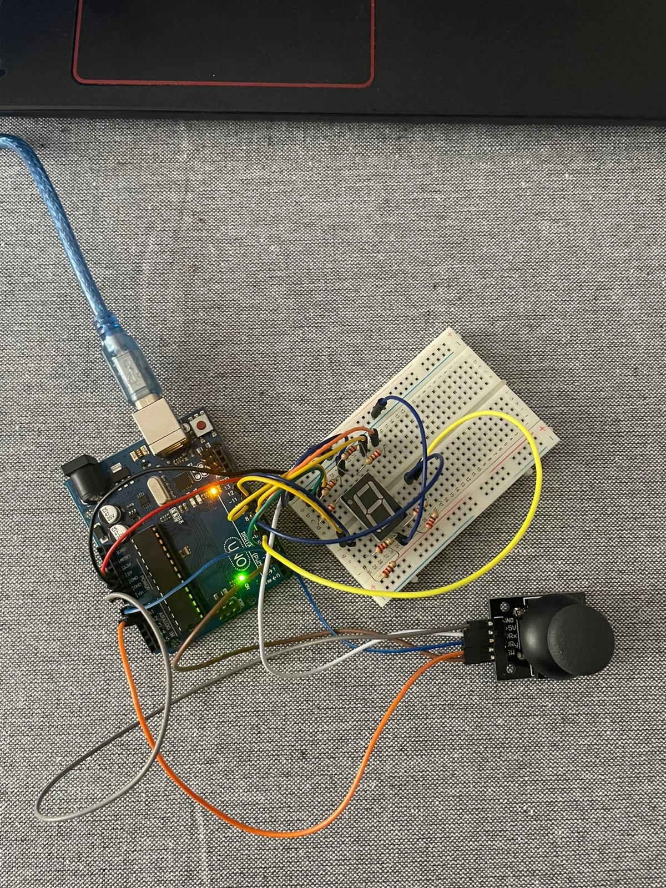

# Introduction-to-Robotics-2023---2024-

Robotics Course Homework Repository - University of Bucharest

This GitHub repository is dedicated to organizing and managing your homework assignments for the Robotics course at the Faculty of Mathematics and Computer Science, University of Bucharest. It provides a structured platform for storing, tracking, and sharing your work throughout the course.

🌟Key Features🌟

📚Homework Structure📚

Each homework assignment is organized in a dedicated folder, making it easy to locate and manage individual tasks.

🎯Requirements🎯

Within each homework folder, you will find a detailed document outlining the specific requirements and objectives for that assignment. This document helps you understand what is expected for successful completion.

🧩Implementation Details🧩

Accompanying the requirements document is a comprehensive guide that provides implementation details, guidelines, and any relevant theory or concepts you should consider while working on the assignment.

💻Code💻

Your code implementations are stored within the repository, ensuring version control and collaboration with your peers. Code files can be organized by homework task or included in subfolders for better organization.

📷Media Files📷

To enhance your documentation, the repository supports the inclusion of image files and videos. You can use these to demonstrate your robot's performance, visualize results, and provide clear explanations in your homework.

Homework-4
Arduino Joystick and 7-Segment Display Control Project

Description:
This Arduino project combines a joystick and a 7-segment display to create an interactive display control system. The primary features of this project are:

Joystick Control: The joystick is used to navigate through a set of LEDs on the 7-segment display. Moving the joystick left, right, up, or down changes the active LED segment, indicating the selection.

Button Activation: When you press the button on the joystick, the currently active LED segment on the 7-segment display is locked in the "on" state. This allows you to select and highlight a specific segment of the display.

Interactive User Interface: Users can interact with the display by choosing which segment to activate using the joystick. Pressing the button confirms and maintains the selected LED segment's visibility.

This project provides an engaging way to interact with a 7-segment display, making it ideal for educational purposes, simple games, or visual feedback systems where users need to make choices and lock in their selections using a joystick and a button.

Youtube link: https://youtube.com/shorts/A26_jcTZje8?feature=share

