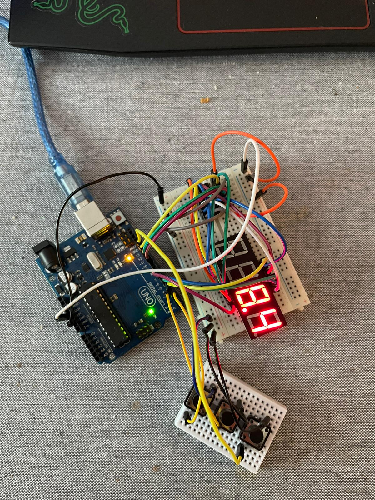

# Introduction-to-Robotics-2023---2024-

Robotics Course Homework Repository - University of Bucharest

This GitHub repository is dedicated to organizing and managing your homework assignments for the Robotics course at the Faculty of Mathematics and Computer Science, University of Bucharest. It provides a structured platform for storing, tracking, and sharing your work throughout the course.

🌟Key Features🌟

📚Homework Structure📚

Each homework assignment is organized in a dedicated folder, making it easy to locate and manage individual tasks.

🎯Requirements🎯

Within each homework folder, you will find a detailed document outlining the specific requirements and objectives for that assignment. This document helps you understand what is expected for successful completion.

🧩Implementation Details🧩

Accompanying the requirements document is a comprehensive guide that provides implementation details, guidelines, and any relevant theory or concepts you should consider while working on the assignment.

💻Code💻

Your code implementations are stored within the repository, ensuring version control and collaboration with your peers. Code files can be organized by homework task or included in subfolders for better organization.

📷Media Files📷

To enhance your documentation, the repository supports the inclusion of image files and videos. You can use these to demonstrate your robot's performance, visualize results, and provide clear explanations in your homework.

Homework-5

Stopwatch timer with reset and save laps

Build an Arduino project featuring a 4-digit 7-segment display, start/stop buttons, and lap recording. The code, leveraging millis(), manages the timer, with a lap button records. A reset button resets the stopwatch, offering a compact and effective timekeeping solution.
Youtube link: https://youtube.com/shorts/PJXRDPeSGAw?feature=share

